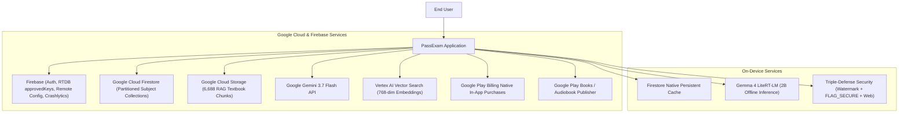

# 01. System Overview

## 1. Technology Stack Overview

**PassExam** uses a pure Google Cloud ecosystem, multi-subject collection partitioning, native offline persistence, and hybrid dual AI tutoring, supporting 18+ Cisco subjects (5,000+ questions), NotebookLM Study Workspace, GCS knowledge packs, and Google Play Books automated publication.

| Category | Technology | Purpose |
|---|---|---|
| **Frontend** | Flutter 3.x / Dart 3.x | Cross-platform Android & Web with Android 15/16 Edge-to-Edge support. |
| **UI Safety** | `SafeImageWidget` + `compute()` | 1024px image downsampling against OOM; isolate offloading against `StringBuffer._addPart` ANR. |
| **Primary Database** | Google Cloud Firestore | Partitioned question collections, native persistent caching, real-time streams. |
| **Realtime Index** | Firebase RTDB | Lightweight `approvedKeys` index, presence, and global model broadcast (`ai_model_config`). |
| **Vector Search** | Vertex AI Vector Search / Firestore Vector Search | 768-dimensional semantic embeddings. |
| **Asset Storage** | Google Cloud Storage (GCS) | 6,688 textbook chunks, network topology diagrams, publication artifacts. |
| **Authentication** | Firebase Auth | Google Sign-In, Email/Password, Anonymous, single-device tracking. |
| **Cloud AI** | Gemini 3.7 Flash (Hybrid Reasoning) | Dynamic Thinking reasoning, filtered thoughts, adaptive temperature. |
| **AI Dispatch** | Firebase Remote Config | 4-tier hierarchy: `Local Override → RTDB Broadcast → Remote Config → Defaults`. |
| **On-Device AI** | Gemma 4 LiteRT-LM (2B) | 4096-token budget via LiteRT for uncapped offline tutoring. |
| **Monetization** | Google Play Billing (Play Billing Library 6+) | Native in-app purchases and subscriptions. |
| **Monitoring** | Firebase Crashlytics + Google Cloud Logging | Comprehensive crash reporting and telemetry. |
| **Security** | Triple-Defense Matrix | Dynamic Watermark + Native `FLAG_SECURE` + `WebSecurityWrapper`. |

## 2. System Context Diagram

