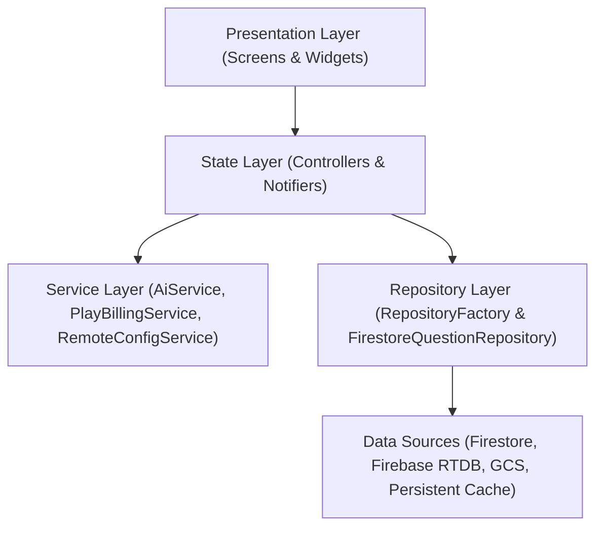

# 02. Architecture Design

## 1. Layered Architecture
PassExam strictly follows Clean Architecture and the Repository pattern:

## 2. `RepositoryFactory` Subject Routing
Routes subject queries to specific Firestore collection paths with cache-first persistence:
- `cisco-200-301` ➔ `exam_subjects/cisco-200-301/questions`
- `cisco-300-410` ➔ `exam_subjects/cisco-300-410/questions`
- `cisco-350-401` ➔ `exam_subjects/cisco-350-401/questions`

## 3. 4-Tier AI Dispatch
1. **Tier 1 (Local Override)**: Admin test override.
2. **Tier 2 (RTDB Broadcast)**: High-speed live broadcast via `ai_model_config`.
3. **Tier 3 (Remote Config)**: Cloud remote configuration.
4. **Tier 4 (Static Defaults)**: `gemini-3.7-flash` (online) & `gemma-4-2b` (offline).
