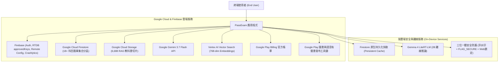

# 01. 系統總覽 (System Overview)

## 1. 技術堆疊總覽 (Technology Stack Overview)

**PassExam** 採用純血 Google 雲端生態系、多科目集合隔離、本地優先離線快取 (Offline-first) 與旗艦/端側雙 AI 驅動的技術堆疊，支援 18+ Cisco 專業科目（5,000+ 題庫）、通用 NotebookLM 學習工作區、GCS 教科書知識庫與 Google Play 圖書/有聲書全自動發布管線。

| 類別 | 技術 | 用途 |
| :--- | :--- | :--- |
| **前端框架** | Flutter 3.x / Dart 3.x | Android、Web 跨平台 UI，全面支援 Android 15/16 Edge-to-Edge 無邊框。 |
| **UI 效能安全** | `SafeImageWidget` + `compute()` | 1024 寬度圖片降取樣防 OOM；文字/日誌運算派生 Isolate 防 `StringBuffer._addPart` ANR 死鎖。 |
| **主資料庫** | Google Cloud Firestore | 18+ Cisco 專業科目題庫、集合分區隔離、原生離線持久化與即時串流。 |
| **即時狀態與索引** | Firebase RTDB | 輕量化 `approvedKeys` 索引節點、全域系統配置廣播 (`ai_model_config`) 與即時狀態同步。 |
| **向量檢索** | Vertex AI Vector Search / Firestore Vector Search | 768 維度語意向量檢索與考點關聯分析。 |
| **檔案與教材儲存** | Google Cloud Storage (GCS) | 6,688 個去雜訊官方教科書切片、考題網路拓撲圖與出版封裝。 |
| **身分驗證** | Firebase Auth | Google 登入、Email/密碼、匿名登入與單一裝置綁定 (activeDeviceId)。 |
| **雲端旗艦 AI** | Gemini 3.7 Flash (Hybrid Reasoning) | 具備 Dynamic Thinking 思考深度、過濾 `thought: true`、自適應 Temperature 1.0。 |
| **AI 雲端調度** | Firebase Remote Config | 四層階層式調度：`本機覆寫 ➔ RTDB 廣播 ➔ Remote Config ➔ 內建預設值`。 |
| **端側離線 AI** | Gemma 4 LiteRT-LM (2B) | 鎖定 4096 Tokens 預算，解除 200 字截斷，提供生活化比喻與 Cisco CLI 手把手教學。 |
| **金流與訂閱** | Google Play Billing (Play Billing Library 6+) | 官方應用程式內購與訂閱管理 (In-App Purchases)。 |
| **診斷與監控** | Firebase Crashlytics + Google Cloud Logging | 原生與 Dart 層級崩潰捕捉、遙測監控與 Admin Debug Log。 |
| **多語系在地化** | `easy_localization` | 4 國語系 (EN, JA, zh-TW, zh-CN) 完整字典，zh-TW 嚴格對齊台灣網路術語。 |
| **安全防護矩陣** | 三位一體安全防護 | 動態浮水印 (`EnhancedSecurityWatermark`) + 原生 `FLAG_SECURE` + `WebSecurityWrapper`。 |

## 2. 系統上下文圖 (System Context Diagram)

