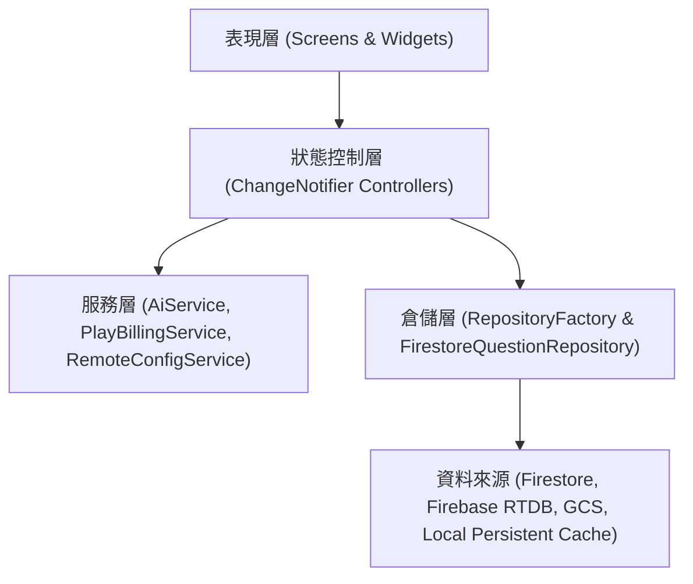

# 02. 架構設計 (Architecture Design)

## 1. 分層架構 (Layered Architecture)
PassExam 嚴格遵循乾淨架構 (Clean Architecture) 與 Repository 模式：

## 2. `RepositoryFactory` 智慧科目路由
`RepositoryFactory` 依據請求的認證考科 ID (`subjectId`) 自動路由至對應的 Cloud Firestore 集合路徑，並優先從本地持久化快取載入：
- `cisco-200-301` ➔ `exam_subjects/cisco-200-301/questions`
- `cisco-300-410` ➔ `exam_subjects/cisco-300-410/questions`
- `cisco-350-401` ➔ `exam_subjects/cisco-350-401/questions`

## 3. 四層階層式 AI 調度架構
1. **第 1 層 (本機覆寫)**: 管理員於測試畫面選定之臨時模型。
2. **第 2 層 (Firebase RTDB 廣播)**: `ai_model_config` 節點即時下發之模型設定。
3. **第 3 層 (Firebase Remote Config)**: 雲端全域發布之模型代號與參數。
4. **第 4 層 (內建預設值)**: `gemini-3.7-flash` (雲端) 與 `gemma-4-2b` (端側)。
