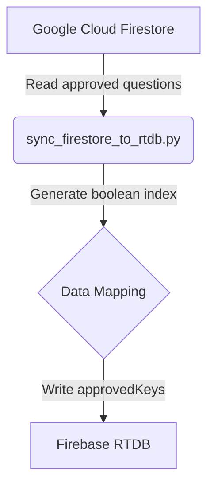

# Sync Operations

> **AI Agent Target:** Details execution logic of `sync_firestore_to_rtdb.py` and `generate_ai_explanations.py`.
> **Human Target:** Explains how data synchronizes between Cloud Firestore and Firebase RTDB.

## `sync_firestore_to_rtdb.py`

Synchronizes the high-performance Firebase RTDB `approvedKeys` index with Google Cloud Firestore master collections.

### Key Operations
- **Lightweight Indexing:** Builds `approvedKeys/{examId}/{questionId}: true` in RTDB, preventing client JVM OOM by eliminating redundant payload downloads.
- **Cache Integrity:** Maintains consistency with client Firestore persistent cache.

## `generate_ai_explanations.py`

Batch generates multi-language explanations (EN, JA, zh-TW) with conceptual analogies and Cisco CLI walkthroughs using Gemini 3.7 Flash.
