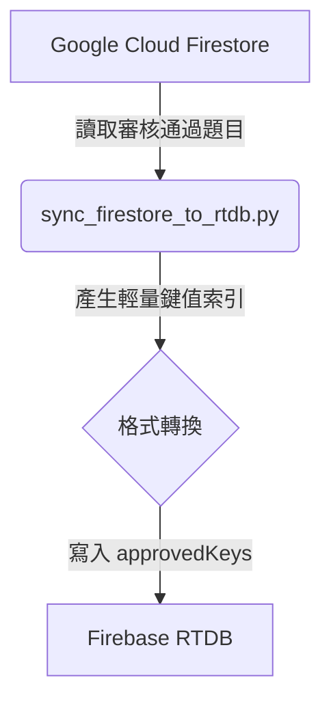

# 同步操作 (Sync Operations)

> **AI Agent Target:** Details execution logic of `sync_firestore_to_rtdb.py` and `generate_ai_explanations.py`.
> **Human Target:** 說明資料如何在 Cloud Firestore 與 Firebase RTDB 間同步，以及如何產生自動化解析。

## `sync_firestore_to_rtdb.py`

此腳本確保用於即時高併發查詢的 Firebase RTDB `approvedKeys` 索引與 Cloud Firestore 題庫保持絕對同步。

### 操作特點
- **輕量索引產生:** 於 Firebase RTDB 建立 `approvedKeys/{examId}/{questionId}: true`，客戶端僅需載入布林索引即可完成列表渲染，避免全量題庫下載引發記憶體尖峰。
- **快取一致性:** 確保行動端 Firestore 離線持久化快取與雲端資料版本同步。

## `generate_ai_explanations.py`

使用 Gemini 3.7 Flash 批次為缺乏詳解的題目產出多語系（英、日、繁中）專業概念比喻與 Cisco CLI 實作指引。

- **斷點續傳:** 自動略過已有高精度解析之考題。
- **即時回寫:** 產生完成後直接寫入 Firestore，觸發即時串流更新至客戶端。
